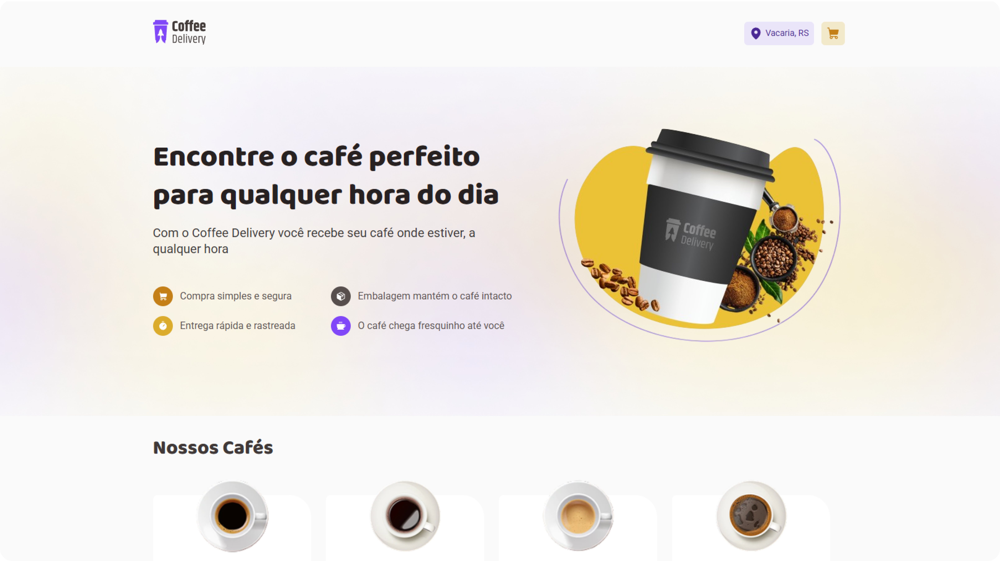
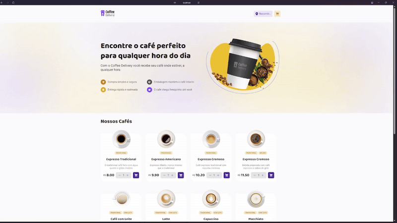

# Coffee Delivery ☕

<div align="center">
  
</div>

## 📝 Projeto

> Formação Fullstack - Rocketseat

Este projeto foi desenvolvido como parte da trilha de ReactJS da formação da Rocketseat, com o objetivo de reforçar conceitos fundamentais de React e práticas modernas de desenvolvimento. A aplicação simula o sistema de uma cafeteria online, onde o usuário pode visualizar diferentes tipos de cafés, selecionar quantidades, preencher seus dados de entrega e escolher o método de pagamento.

O foco principal está em entregar uma experiência fluida e funcional, tanto na exibição dos produtos quanto na finalização da compra, aplicando conceitos essenciais do React e boas práticas de componentização.

## ✨ Funcionalidades

- **Listagem de produtos (cafés):** Cafés disponíveis para visualização e compra, com nome, descrição e valor.
- **Gerenciamento de carrinho de compras:**
  - Adicionar um ou mais cafés com quantidade personalizada.
  - Aumentar ou diminuir a quantidade diretamente no carrinho.
  - Remover cafés do carrinho.
- **Formulário de endereço:** O usuário informa seus dados de entrega, com validações.
- **Escolha do método de pagamento:** Cartão de crédito, débito ou dinheiro.
- **Resumo da compra:**
  - Exibe o total de itens, entrega e o valor final.
  - Mostra o número de itens no carrinho diretamente no Header.
- **Confirmação de pedido:** Tela de sucesso com os dados do pedido e visual animado.

### 🔥 Extras que adicionei por conta própria

- **Animação da motoca do café** 🛵💨  
  Uma animação simples com o “* motoboy*” durante a tela de confirmação, trazendo mais vida e personalidade à experiência do usuário.
  
- **Localização dinâmica com o navegador:**  
  A aplicação utiliza a API de geolocalização do navegador para detectar automaticamente a cidade do usuário e exibi-la no cabeçalho, tornando a experiência mais personalizada e contextualizada.

## 🚀 Conceitos Trabalhados

- Estados e imutabilidade
- Componentização e reutilização
- Manipulação de arrays (como `.reduce`)
- Context API para o carrinho de compras
- LocalStorage para persistência do carrinho
- Props e tipagem com TypeScript
- Validação com React Hook Form + Zod
- Rotas com React Router
- Consumo de APIs externas
- Estilização com Styled Components

## 🛠️ Tecnologias Utilizadas

- ReactJS
- TypeScript
- Vite
- Styled Components
- React Hook Form 
- React Router DOM
- Phosphor Icons
- JSON server


## 📦 Como executar o projeto

```bash
# Clone este repositório
$ git clone https://github.com/seu-usuario/coffee-delivery.git

# Acesse a pasta do projeto
$ cd coffee-delivery

# Instale as dependências
$ npm install

# Inicie a aplicação
$ npm run dev
```

A aplicação estará disponível em: [http://localhost:5173](http://localhost:5173)

## 📸 Preview

<div align="center"> 
  
</div>


## 🧠 Aprendizados

Este projeto me ajudou a consolidar conceitos importantes como o uso da Context API, imutabilidade e manipulação de listas. Também foi meu primeiro contato mais aprofundado com formulários reativos usando React Hook Form.

Além disso, mesmo não sendo parte do desafio proposto, decidi ir além e implementei:
- A busca automática de endereço via geolocalização do navegador.
- Uma animação simples e divertida do motoboy na confirmação do pedido.

Esses toques pessoais trouxeram mais vida à aplicação e reforçaram a importância de pensar na experiência do usuário.

## 💌 Contato

<p align="center">Feito com 💛 por <a href="https://www.linkedin.com/in/gabyteixeira">Brush</a></p>

